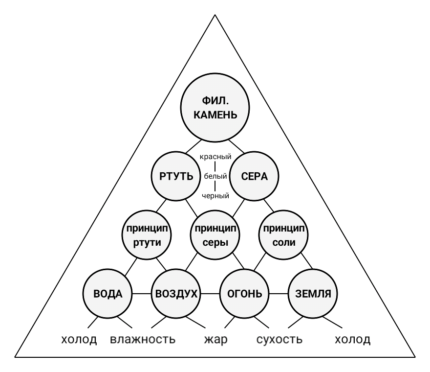

В наиболее широком понимании алхимия — искусство преобразования (трансмутации) в направлении совершенства. Преобразуется как вещественное, так и нематериальное. Преобразование возможно, потому что материя пронизана духом, который «направляет и наделяет жизнью все, что есть в мире, который служит как орудие или приспособление» высшего разума. Прибавление чистого духа к материи, приближает совершенство. Но в то же время материя может порождать зло, которое устраняется только человеком, который умеет предохранять себя от зла, благодаря своей душе и уму. Душа пришла к человеку из жизни, ум пришел к нему от высшего разума.  

Цель алхимии — не просто создание золота, но чудесное преображение материального мира, сотворение нового, совершенного космоса, трансмутация, путем одухотворения материи.

# Теоретическая алхимия

В основании герметической теории лежит закон единства материи. Материя одна, но принимает различные формы, комбинируя качества и производя бесконечное количество новых тел. 

**Первичная материя** это гипотетическое хаотическое состояние в котором перемешаны первоэлементы: земля, огонь, вода и воздух. Элементы обладают качествами – влажностью, жаром, сухостью, холодом, которые делают их полезными, нейтральными или вредными. Алхимики легко заменяют термины и первичные элементы приобретают совершенно иные наименования. Например, огонь становится разумом, воздух – желаниями, вода – жизненной энергией, земля – реальностью. Путем замены терминов и определений, алхимия становится гибким средством решения совершенно разных вопросов и проблем.

Для производства философского камня материя упорядочивается – выделяются сущностные элементы и качества. Для назначения и выделения качеств используют сущностные принципы, которые представляют собой Субстанции, близкие к сущности людей и вещей. Выделяют ценные качества материи и сопутствующие, которые обеспечивают проявление ценных качеств.

**Принцип Серы** – выделение постоянных качеств материи, представляющих самостоятельную ценность.

**Принцип Меркурия** (ртути) – выделение изменчивых сопутствующих качеств материи, не представляющих самостоятельной ценности. 

**Принцип Соли** – создание наглядного образа ценных качеств материи.

**Соль** - формы организации матери.

**Сера** – ценные качества материи.     

**Ртуть** – изменчивые качества материи, сопутствующие ценным.

Изменчивые качества составляют философскую ртуть, а ценные качества, принявшие образ – философскую серу. Ртуть образуется в результате поглощения некоторого количества ценных качеств  определенным количеством нужных качеств. Сера образуется в результате наделения форм определенным количеством ценных качеств. Философская сера – образы материи, демонстрирующие ценные качества. Философская ртуть – изменчивые качества, которыми необходимо наделить материю, для того, чтобы она приобрела ценность. Материя готовится к великому деланию. По принципу меркурия, от материи отделяют сущности, которыми  необходимо наделить материю для получения ценных свойств.  По принципу серы, от материи отделяют сущности, составляющие ценность. По принципу соли, из первичных элементов материи составляют образы. При одновременном применении принципа соли и принципа серы, философское золото становится образом реальности, наделенным ценностью. В последующем, на красной стадии Великого делания, этот образ пригодятся.

Философские золото и серебро запечатывают в реторту – философское яйцо, которое помещают в атанор – печь для производства главного алхимического труда – Великого делания. Великое делание состоит из трех последовательных процессов – черного, белого и красного труда, когда реторта опаляется огнем разума и медленно нагревается. Изменяя в ходе Великого делания меру, пропорции, иерархию, взаимодействие, соотношения ценных и нужных качеств, изменяя формы первичных элементов, можно создавать совершенствовать вещи. По общему правилу, чем больше ценных качеств в материи, тем она совершеннее. Для получения золота формам материи сообщается смысл их существования.  Для получения серебра выделяются качества, формирующие смысл. В результате смешения возникал алхимический брак красного Короля и белой Королевы. Союз Короля и Королевы ведет к появлению двойственной субстанции — мертвого для мира существа, которое называли по разному — «ребис», «гомункул».

В ходе **черного труда** ненужные и вредные качества реальности подвергаются гнилению и осаждаются. В результате остаются ценные и нужные качества. 

В ходе **белого труда** ценные и нужные качества разделяются, проявляются в нужной мере, между качествами устанавливаются пропорции, иерархия, организуется взаимодействие. Мертвое для мира существо, возникшее из помещенных в реторту качеств, оживает, у него появляются зачатки сознания, некоторая способность изменять действительность.

**Красный труд** формирует эликсир – абстрактным качествам придают организованную форму, способную преобразовывать действительность. увеличивая ее ценность. Для получения чудодейственной формы используют выделенные с помощью принципа соли образы реальных форм, которые на практике показали результативность. В ходе красного труда изменчивые качества соединяют с образом, демонтирующим ценные качества. В результате получают чудодейственный эликсир, способный преобразовывать действительность, увеличивая её ценность.

**Ферментация** – философский камень прикладывается к действительности. Сила правильно изготовленного философского камня при соприкосновении с действительностью возрастает. 

Полученный философский камень проверяют. Для этого его прикладывают к действительности. Прикосновение философского камня уничтожает несбыточные и усиливает разумные желания, показывает ценности, которыми может обладать действительность, соединяет имеющиеся силы для увеличения ценности действительности, нейтрализует возможное противодействие, направляет и организует личные и коллективные усилия на достижение цели. Сила настоящего философского камня от соприкосновения с действительностью умножается. Пустышка, выдаваемая за философский камень, никак себя не проявляет.

# Практическая алхимия

Конец химическим занятиям алхимиков положил английский ученый Роберт Бойль, который в 17 веке доказал химическую неизменность элементов. Но сохранилось искусство преобразования не химических элементов, а сложных вещей и сознания. Для использования алхимического искусства необходимо заменить имена и сохранить ритуалы.

Ценные качества явления и сопутствующие качества. Характеристики, качества, свойства.

В действительности мы наблюдаем проявления каких либо сил, процессов. которые выражают сущности предметов, процессов. непосредственное отражение вещи в чувственном восприятии. Всякое проявление чего-л., каких-л. сил, процессов. Явление – изменение состояния материи под воздействием каких либо сил, процессов. 

**Качество** – существенная определенность предмета, явления или процесса, в силу которой он является данным, а не иным предметом, явлением или процессом. 

Определить качества, характеристики, приобрести качество, создать новые качества, изменить существующие.

**Элементы землепользования**: земельные участки; земли; территории. Качества территории: капитальные строения; благоустройство, оборудование территории.

## Принципы проектирования

1. Принцип постоянных ценных качеств.
2. Принцип изменчивых сопутствующих качеств.
3. Принцип демонстрации ценных качеств. 

# Приложение

Какими реальными ценностями обладает конкретная территория. Она позволяет срубить бабла на перепродаже земельных участков. Для этого территория наделена определенными качествами, как то: .

## Действительность

На сегодняшний день, как я понимаю, земельные участки, расположенные в кадастровом квартале 50:14:0020336 (элемент планировочной структуры "тер. Сады на реке") были  распроданы до 2020 г.  как земельные участки в  ПРОЕКТИРУЕМЫХ границах населенного пункта утвержденных РЕШЕНИЕМ_N совета депутатов ,на землях категории "земли сельскохозяйственного назначения" без попыток согласования смены категории земель с Минсельхозом. И всё "прокатило бы.." по этой схеме как и прежде, но изменения законодательства с 01.01.2019 г и  ввод 217-ФЗ порушило всю эту схему по распродаже сельхоз земель поскольку до 01.01.2019 г. граждане, собственники зем. участков, были обязаны образовывать из таких зем. участков "территорию садоводства" с последующим управлением этой территорией, а сегодня в отсутствии территории садоводства большинство собственников не желает и не обязано  образовывать и  управлять "территорией садоводства", нести расходы ,и на то сегодня ,у собственников зем. участков  есть  все законные основания.

Администрация Щёлковского района (округа) обеспечила в 2012 г. своим решением землеотвод и распродала посредством услуг индивидуальных предпринимателей  земельные участки гражданам без обременений о обязательств – "в утвержденных Границах населенного пункта", так будьте любезны уважаемые представитель Администрации взять на баланс и обслужить свои территории, а не включать "заднею" и говорить, ой а Вы знаете, а вот по новому, утвержденному нами же Генплану но уже в 2021 г. все ваши земельные участки НЕ в границах населенного пункта и живите как знаете...

Участки получили качества, присвоение которых не требуют особых затрат, но необходимы для придания товарного вида. Набор качеств, нужных для комфортного проживания, в целях экономии средств, территории не даны, не сообщены.

## Реальность

Земельные участки, расположенные в кадастровом квартале 50:14:0020336 образованы из земельного участка сельскохозяйственного назначения, который в свою очередь был образован в результате выдела в натуре сельскохозяйственных долей, принадлежащих работникам бывшего совхоза. Выделенные в натуре земельные доли были оформлены на одного собственника, который своим решение разделил большой участок и образовал земельные участки с разрешенным использованием «для дачного строительства». Образованные земельные участки, которые своим видам напоминают улицы и проезды, также предназначены для дачного строительства и находятся в частной собственности физического лица. Участки проданы одним физическим лицом другим физическим лицам. Все 300 земельных участков имеют по сведениям Единого государственного реестра недвижимости одинаковый адрес: Московская область, Щелковский район, д. Каблуково. Сведений об адресах земельных участков в Федеральной информационной адресной системе нет.  Адреса участкам нее присвоены. Категория земель – земли сельскохозяйственного назначения. Разрешенное использование: «Для дачного строительства». Проект планировки и проект межевания территории не составлялся.

ПРОЕКТИРУЕМЫХ границ населенного пункта на месте дачных земельных участков никогда не существовало, как и элемента планировочной структуры "тер. Сады на реке". Документ, в соответствии с которым, якобы был образован данный элемент планировочной структуры – подделка. 

Администрация Щелковского района решение о землеотводе участков в кадастровом квартале 50:14:0020336 не принимала и не распродавала участки гражданам.

При подготовке к великому деланию очищали первичную материю: выделяли серу и ртуть. Подготовка – выделение первичной материи из обычной, путем удаления влаги - жизненной силы. Выделенную из материи серу и ртуть смешивали в философском яйце. В результате такого смешения возникал алхимический брак красного Короля и белой Королевы. Союз Короля и Королевы ведет к появлению двойственной субстанции — мертвого для мира существа, которое называли по разному — «ребис», «гомункул».

Ознакомившись с реальной ситуацией, выясняем намерения сопричастных к ситуации лиц. Если намерения не четкие, расплывчатые, выясняем цели, задавая вопрос: «С какой целью намереваетесь действовать?». Заявленные цели составляют задание на проектирование, на разработку плана действий. с

# Воплощение желаний

Алхимия не меняет душу, а укрепляет дух. 

Квинтэссенция – &#x1F700;
Воздух –   &#x1F701;
Огонь – &#x1F702;
Вода –  &#x1F704;
Земля – &#x1F703;
Соль –  &#x1F714;
Ртуть – &#x263F;
Сера –  &#x1F70D;
Философская сера – &#x1F70E;
Золото –  &#x1F71A;
Серебро – &#x1F71B;
Свинец –  &#x2644;
Свинцовая руда –  &#x1F72A;
Азотная кислота –  &#x1F705;
Царская водка –  &#x1F706;  
Сублимация – &#x1F75E;
Осаждение –   &#x1F75F;
Дистилляция –  &#x1F760;
Растворение –   &#x1F761;
Очищение – &#x1F763;
Гниление –  &#x1F764;
Тигель – &#x1F765;
Реторта –  &#x1F76D;
Месяц –  &#x1F771;

