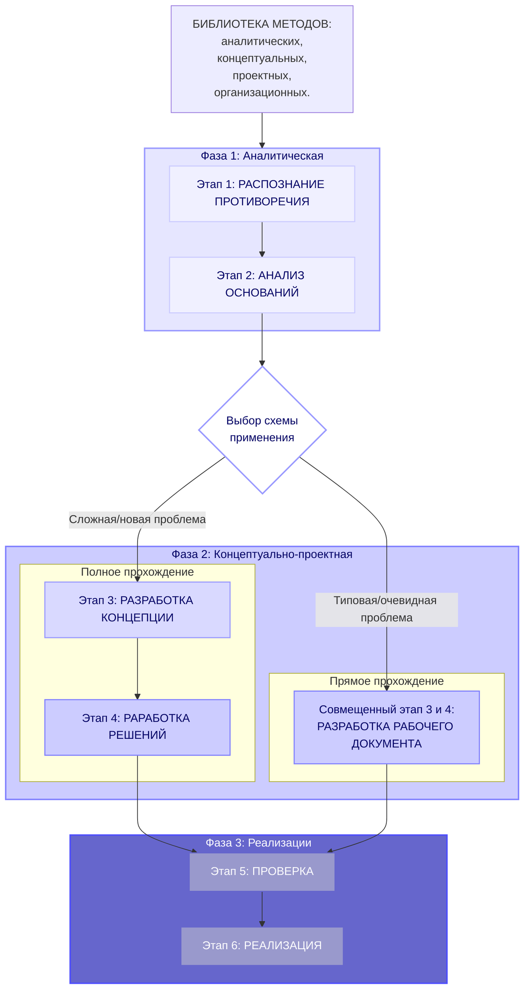

Концептуально-проектный метод (КПМ) — это инструмент для решения широкого спектра территориальных вопросов, от юридических коллизий и урегулирования конфликтов до территориального проектирования и подготовки управленческих решений.

Метод построен на системном подходе и принципе суверенитета землепользователей. Его ключевая особенность — универсальная архитектура, в рамках которой фаза разработки решений может включать как проектирование, так и подготовку документов или организационных мер.

Главная цель КПМ — предоставить заинтересованным лицам, включая непрофессионалов, доступный инструмент для самостоятельного разрешения территориальных противоречий с сохранением полного контроля над процессом и его результатами.

{% include mermaid.html content='
flowchart TD


	K["БИБЛИОТЕКА МЕТОДОВ:<br>аналитических,<br>концептуальных,<br>проектных,<br>организационных."]
	K --> S1
	subgraph S1[Фаза 1: Аналитическая]
	    B["Этап 1: РАСПОЗНАНИЕ ПРОТИВОРЕЧИЯ"]
	    C["Этап 2: АНАЛИЗ ОСНОВАНИЙ"]
	    B --> C
	end
	  
	C --> D{Выбор схемы <br>применения}
	
	subgraph S2[Фаза 2: Концептуально-проектная]
	    subgraph S2_1[Полное прохождение]
	        E["Этап 3: РАЗРАБОТКА КОНЦЕПЦИИ"]
	        F["Этап 4: РАРАБОТКА РЕШЕНИЙ"]
	        E --> F
	    end
	
	    subgraph S2_2[Прямое прохождение]
	        G["Совмещенный этап 3 и 4:<br>РАЗРАБОТКА РАБОЧЕГО ДОКУМЕНТА"]
	    end
	end
	
	D -- "Сложная/новая проблема" --> E
	D -- "Типовая/очевидная проблема" --> G
	
	F --> H
	G --> H
	
	subgraph S3[Фаза 3: Реализации]
	    H["Этап 5: ПРОВЕРКА"]
	    I["Этап 6: РЕАЛИЗАЦИЯ"]
	    H --> I
	end
	
	%% Стили для фаз
	style S1 fill:#e6e6ff,stroke:#9999ff,stroke-width:2px,color:#000066
	style S2 fill:#ccccff,stroke:#8080ff,stroke-width:2px,color:#000066
	style S3 fill:#6666cc,stroke:#4d4dff,stroke-width:2px,color:#ffffff
	
	%% Стили для этапов
	style B fill:#f0f0ff,stroke:#ccccff,stroke-width:1.5px,color:#000066
	style C fill:#f0f0ff,stroke:#ccccff,stroke-width:1.5px,color:#000066
	style E fill:#d9d9ff,stroke:#9999ff,stroke-width:1.5px,color:#000066
	style F fill:#ccccff,stroke:#8080ff,stroke-width:1.5px,color:#000066
	style G fill:#ccccff,stroke:#8080ff,stroke-width:1.5px,color:#000066
	style H fill:#9999cc,stroke:#6666cc,stroke-width:1.5px,color:#ffffff    
	style I fill:#9999cc,stroke:#6666cc,stroke-width:1.5px,color:#ffffff    
	%% Стиль для ромба решения
	style D fill:#ffffff,stroke:#9999ff,stroke-width:2px,color:#000066

' 
caption="Схема применения концептуально-проектного метода" 
number="3"
%}

Схема применения концептуально-проектного метода демонстрирует его гибкость и адаптивность для различных задач. Применимы две основные схемы:

**1\. Полное прохождение (этапы 1-2-3-4-5-6)**
Применяется для сложных, комплексных проблем, требующих глубокого анализа и выработки принципиально новых решений. Последовательное прохождение всех этапов гарантирует учет всех аспектов и создание устойчивой, проработанной концепции перед разработкой итоговых документов или проектов.

**2\. Прямое прохождение (этапы 1-2-[3+4]-5-6)**
Применяется для более простых или типовых ситуаций, где решение очевидно для специалиста после анализа оснований, а его суть может быть сразу воплощена в конкретном документе или техническом решении. В этой схеме этапы 3 (концепция) и 4 (разработка решений) объединяются в одну итерацию.

## 1. Обоснование универсальности и шестиэтапной структуры метода

Концептуально-проектный метод представляет собой системный подход к решению территориальных вопросов, основанный на шестиэтапной структуре. Данная методология обеспечивает последовательное движение от распознания противоречия до его практического разрешения, что позволяет работать с задачами различной сложности.

Ключевые особенности метода:

1. Ориентация на решение реальных проблем.
2. Выявление и анализ интересов причастных лиц.
3. Широкий диапазон применения.
4. Всесторонний анализ всех аспектов проблемы.
5. Методологическая гибкость.
6. Распределение ролей участников.
7. Использование пополняемой библиотеки методов.
8. Доступность для непрофессиональных пользователей.

**Ориентация на решение реальных проблем территории** отличает метод от формального подхода, при котором проектирование осуществляется исключительно для выполнения законодательных требований. Метод исходит из анализа фактических противоречий и потребностей, что позволяет создавать решения, направленные на устранение конкретных проблем, а не только на формальное соблюдение процедур.

**Анализ интересов причастных лиц** проводится на первом этапе и включает выявление всех заинтересованных сторон, их интересов, ресурсных возможностей и административного влияния. Такой подход обеспечивает разработку решений, ориентированных на реализацию конкретных интересов, обеспеченных необходимыми ресурсами.

**Широкий диапазон применения** метода охватывает различные типы задач - от подготовки отдельных проектов распорядительных актов и нормативных документов до проектов организации территории.

**Всесторонний анализ** предполагает исследование правовых, экономических, социальных и территориальных аспектов для каждой задачи, что обеспечивает глубину проработки и обоснованность принимаемых решений.

**Методологическая гибкость** позволяет адаптировать метод к широкому спектру задач. Первые три этапа формируют неизменное аналитическое ядро, в то время как этапы 4-6 могут быть гибко настроены под требования конкретной ситуации.

**Распределение ролей** обеспечивает сохранение суверенитета правообладателей на ключевых этапах процесса в сочетании с возможностью привлечения внешних специалистов для технической реализации на строго определенных условиях.

**Использование пополняемой библиотеки методов** позволяет выбирать оптимальные аналитические, концептуальные и проектные инструменты для каждого конкретного случая.

**Доступность для непрофессиональных пользователей** достигается за счет методологической структуры и инструментария, разработанных с учетом возможности применения лицами без специального образования при сохранении профессионального уровня решений.

Универсальность метода подтверждается его способностью обеспечивать качественную проработку территориальных вопросов разного уровня сложности при сохранении системности подхода и контроля со стороны заинтересованных лиц. Метод может быть встроен в процессы формального проектирования, повышая их практическую значимость и ориентацию на решение реальных проблем, даже при отсутствии прямого законодательного регулирования такой интеграции.

## 2. Концепция суверенитета над территориальными решениями

Концепция суверенитета над территориальными решениями устанавливает принцип участия правообладателей в процессе работы с территорией. Данный подход обеспечивает системный контроль на всех этапах - от принятия решений до их практической реализации.

Ключевые компоненты концепции включают четыре фундаментальных права:

1. Право на инициативу в выборе проблемы.
2. Право на анализ ситуации.
3. Право на концепцию решения.
4. Право на контроль реализации.

**Право на инициативу** предоставляет возможность самостоятельного определения проблемной ситуации и начала процесса её урегулирования. Это право обеспечивает активную роль правообладателей в определении актуальных вопросов, требующих решения.

**Право на анализ** обеспечивает участие в изучении информации и формировании целостного понимания причинно-следственных связей выявленной ситуации. Данное право обеспечивает обоснованность принимаемых решений за счёт исследования всех существенных аспектов.

**Право на концепцию** включает утверждение конечного видения разрешения ситуации и установление критериев оценки успешности решения. Это право позволяет правообладателям определять направления развития территории и стандарты достижения целей.

**Право на контроль реализации** обеспечивает участие в приемке подготовленных решений и мониторинг их практического воплощения. Данное право завершает цикл управления, гарантируя соответствие результатов утвержденной концепции и первоначальным целям.

Концепция суверенитета над территориальными решениями создает комплексный механизм управления территорией, обеспечивающий полный контроль правообладателей на всех этапах работы. Данный подход формирует правовые и организационные основания для устойчивого и ответственного развития территорий, позволяя реализовывать проекты различной сложности при сохранении суверенитета принятия решений.

## 3. Детализация этапов 

### 3.1. Первый этап. Распознание противоречия

Первый этап метода направлен на формирование понимания проблемной ситуации через выявление и анализ ключевого противоречия. Данная стадия обеспечивает переход от интуитивного восприятия проблемы к её структурированному описанию, что является необходимым условием для разработки решений.

Основные задачи этапа включают:

1. Распознание и структуризация противоречия.  
2. Анализ заинтересованных сторон.  
3. Предварительную оценку масштаба и сложности проблемы.  
4. Формирование итогового документа - "Карты противоречия".  

**Распознание и структуризация противоречия** представляет собой процесс описания конфликта между текущим и целевым состоянием. Работа ведется по следующим направлениям:  

- выявление нормативных расхождений (противоречия в правовом регулировании);  
- анализ пространственных конфликтов (несоответствия в землепользовании);  
- фиксация социально-экономических дисбалансов (противоречия интересов различных групп);  
- формулирование ясного и однозначного описания проблемы, понятного всем участникам процесса.

**Анализ заинтересованных сторон** включает:  

- выявление заинтересованных сторон: правообладателей, инвесторов, пользователей, регулирующих органов, местного сообщества;  
- анализ интересов, ресурсов и возможностей каждого участника;  
- оценку уровня влияния и заинтересованности участников;
- составление карты интересов с визуализацией позиций и взаимоотношений между участниками.  

**Предварительная оценка масштаба и сложности проблемы** предусматривает:  
- анализ возможных путей разрешения ситуации (от административных обращений до комплексного проектирования);  
- оценку необходимых ресурсов и временных затрат;  
- определение степени сложности и потенциальных рисков;  
- классификацию типа задачи для выбора стратегии работы.  

**Формирование итогового документа** - "Карты противоречия" - включает:  
- формулировку ключевого противоречия;  
- перечень заинтересованных сторон с указанием их интересов и влияния;  
- предварительную классификацию задачи и возможные направления работы;  
- визуальное представление структуры проблемы и взаимосвязей между её элементами.  

Первый этап обеспечивает создание объективной основы для дальнейшей работы, исключая субъективные оценки и предположения. Системный подход к распознанию противоречия позволяет перейти от фрагментарного восприятия проблемы к её целостному пониманию, что является critical-ным условием для разработки эффективных и реализуемых решений.

### 3.2. Второй этап. Анализ оснований ситуации

Второй этап представляет собой комплексное исследование всех существенных аспектов, определяющих контекст проблемной ситуации. Анализ проводится по четырем взаимосвязанным направлениям, обеспечивающим всестороннее понимание предпосылок и условий для разработки эффективных решений.

**Правовое основание** включает анализ существующего правового статуса территории, включая форму собственности, зарегистрированные права, ограничения и обременения. Проводится выявление правовых коллизий, оценка регуляторных требований (градостроительные регламенты, правила землепользования и застройки), а также определение оптимального правового инструментария для реализации проектных решений.

**Экономическое основание** предполагает оценку материальных предпосылок ситуации. Анализ включает изучение экономических интересов всех сторон, оценку ресурсных возможностей и ограничений, исследование моделей стоимостных потоков, расчет альтернативной стоимости и потенциальных экономических эффектов от разрешения ситуации.

**Социальное основание** заключается в исследовании интересов, ценностей и мотиваций ключевых участников. Проводится идентификация всех заинтересованных сторон, анализ их материальных и нематериальных интересов, оценка социальных рисков и возможностей, а также изучение сложившихся коалиций и конфликтов.

**Территориальное основание** охватывает анализ физических характеристик территории, включая природные, исторические и структурные особенности. Исследование включает выявление потенциалов и ограничений развития, анализ существующей и планируемой пространственной организации, а также изучение сложившихся моделей землепользования.

Комплексный анализ по различным основаниям обеспечивает формирование объективной базы для разработки концептуальных решений, учитывающих все существенные аспекты проблемной ситуации и минимизирующих риски при реализации проектов.

### 3.3. Третий этап. Разработка концепции разрешения

Третий этап направлен на преобразование выявленного противоречия в системное решение, создающее основу для развития территории или устранение правовой определенности. Данная стадия обеспечивает переход от анализа проблем к разработке конкретных механизмов их устранения.

Ключевые аспекты этапа включают:

1. Преодоление противоречия через создание новой ценности.
2. Выбор основного направления разрешения ситуации.  
3. Формирование критериев оценки успешности решения.
4. Подготовка итогового документа - технического задания.

**Преодоление противоречия через создание новой ценности** заключается в разработке решения, которое не является компромиссом между конфликтующими интересами, а создает принципиально новое качество. Такой подход позволяет трансформировать исходный конфликт в источник развития, делая его неактуальным через создание дополнительной ценности для всех участников процесса.

**Выбор основного направления разрешения ситуации** предполагает определение оптимального пути реализации концепции. На основе анализа оснований ситуации выбирается комбинация методов работы: территориальное проектирование, подготовка правовых документов, организационные изменения или комплексный подход, сочетающий несколько направлений деятельности.

**Формирование критериев оценки успешности решения** включает разработку измеримых параметров, позволяющих объективно оценить соответствие результатов поставленным целям. Критерии разрабатываются для всех аспектов решения: правовой обоснованности, экономической эффективности, социальной приемлемости и территориальной целесообразности.

**Подготовка итогового документа** завершает этап созданием "Технического задания", которое содержит:

- концептуальную формулу разрешения противоречия;
- иерархию целей от стратегических до тактических;
- комплекс требований к решениям по всем основаниям (правовым, экономическим, социальным, территориальным);
- критерии проверки готовых решений на соответствие исходным целям.

Разработка концепции разрешения обеспечивает подход к преобразованию проблемной ситуации в возможность для развития. Техническое задание служит основой для последующей проектной работы и практической реализации и позволяет обеспечить соответствие конечных результатов первоначальным целям и требованиям заинтересованных сторон.

### 3.4. Четвертый этап. Блок разработки решений

Четвертый этап направлен на создание конкретных продуктов, обеспечивающих практическую реализацию утвержденной концепции разрешения. В зависимости от характера и сложности задачи, разработка осуществляется в одном или нескольких взаимосвязанных направлениях.

Основные возможные направления разработки включают:

1. Подготовку документальных решений.
2. Разработку проектных решений.  
3. Создание организационных решений.
4. Формирование комбинированных решений.

**Подготовка документальных решений** заключается в разработке пакета документов, необходимых для реализации выбранного правового механизма. Работа включает составление заявлений, соглашений, проектов распорядительных актов и иных документов, обеспечивающих правовое оформление решения ситуации.

**Разработка проектных решений** предполагает создание проектной документации в соответствии с утвержденным техническим заданием. В зависимости от специфики задачи, разрабатываются территориальные решения (планировочная организация, проект межевания), управленческие модели (организационная структура, экономический механизм) и социальные проекты (программы взаимодействия с сообществом).

**Создание организационных решений** включает проектирование организационных структур, процессов взаимодействия и рабочих регламентов. Разрабатываются механизмы координации участников, распределения зон ответственности и процедуры принятия решений, обеспечивающие реализацию проекта.

**Формирование комбинированных решений** применяется для комплексного разрешения сложных ситуаций, требующих одновременного использования различных подходов. Сочетание документальных, проектных и организационных форм разработки позволяет создать комбинированную систему мер, обеспечивающую достижение поставленных целей.

Блок разработки решений обеспечивает трансформацию концептуальных положений в конкретные продукты, готовые к практическому применению. Выбор направлений разработки определяется спецификой решаемой задачи и обеспечивает создание целевых инструментов для реализации утвержденной концепции.

### 3.5. Пятый этап. Проверка и согласование

Пятый этап представляет собой процедуру проверки разработанных решений перед их практической реализацией. Данный процесс обеспечивает соответствие подготовленных материалов установленным требованиям и минимизирует риски при внедрении.

Проверка проводится по следующим ключевым направлениям:

1. Проверка соответствия концепции.
2. Оценка соответствия нормативным требованиям.  
3. Анализ ресурсной обеспеченности.

**Проверка соответствия концепции** включает подтверждение того, что разработанные решения полностью реализуют утвержденную концепцию разрешения ситуации. Осуществляется проверка соответствия техническому заданию, включая выполнение всех установленных требований и критериев успешности решения.

**Оценка соответствия нормативным требованиям** предполагает экспертизу разработанных решений на предмет их соответствия действующему законодательству, отраслевым стандартам и нормативным актам. Проводится анализ правовой обоснованности, технической корректности и соответствия нормативным требованиям подготовленных материалов.

**Анализ ресурсной обеспеченности** включает оценку реализуемости решений с точки зрения доступности необходимых ресурсов. Проверяется соответствие временным рамкам, бюджетным ограничениям, кадровым возможностям, а также оценивается социальная приемлемость и организационная осуществимость предлагаемых решений.

Процедура проверки и согласования обеспечивает проверку качества разработанных решений и их готовность к практической реализации. Результатом этапа является заключение о соответствии подготовленных материалов установленным требованиям и возможности их применения для разрешения ситуаций.

### 3.6. Шестой этап. Реализация и сопровождение

Шестой этап завершает процесс практическим внедрением подготовленных решений и их последующим операционным сопровождением. Данная стадия направлена на достижение конкретных результатов и закрепление положительных изменений.

Ключевые задачи этапа включают:

1. Практическое внедрение разработанных решений.
2. Правовую легализацию результатов работы.
3. Организационный запуск новых процессов.
4. Мониторинг и корректировка.

**Практическое внедрение разработанных решений** заключается во внедрении подготовленных документов, проектных разработок и организационных изменений. Осуществляется выполнение запланированных мероприятий в установленные сроки с соблюдением утвержденных параметров качества.

**Правовая легализация результатов работы** включает проведение необходимых юридических процедур для придания решениям официального статуса. Выполняется государственная регистрация прав, утверждение документов в уполномоченных органах, оформление разрешительной документации и иные действия, обеспечивающие правовую действительность реализованных решений.

**Организационный запуск новых процессов** предполагает ввод в действие новых структур, регламентов и процедур взаимодействия. Обеспечивается интеграция разработанных решений в существующую операционную деятельность, проводится обучение персонала и устанавливаются системы контроля за выполнением новых процессов.

**Мониторинг и корректировка** заключаются в отслеживании результатов реализации решений и внесении необходимых изменений. Проводится оценка достижения целевых показателей, анализируется работа реализованных решений и при необходимости осуществляются точечные корректировки для оптимизации результатов.

Этап реализации и сопровождения обеспечивает перевод разработанных решений в практическую плоскость и закрепление достигнутых изменений. Комплексный подход к внедрению и последующему мониторингу гарантирует устойчивость результатов и возможность их дальнейшего развития.

## 4. Практическая значимость и области применения УМРТП

Универсальный Метод Разрешения Территориальных Противоречий представляет собой практический инструмент для:
- Разрешения правовых коллизий и оформления прав на земельные участки и объекты недвижимости.
- Подготовки управленческих решений по вопросам территориального развития.
- Разработки проектной документации различного уровня сложности.
- Организации взаимодействия между stakeholders при решении территориальных вопросов.
- Создания методических материалов и образовательных программ в области территориального управления.

Конечно, вот дополненная версия с краткими инструкциями по применению для каждого метода:

## 5. Библиотека методов концептуальных решений

Универсальность метода обеспечивается за счет создания модульной системы методов концептуальных решений, которые могут применяться на третьем этапе в зависимости от специфики проблемы и контекста ситуации.

### 5.1. Метод схоластического анализа

**Назначение:** Анализ нормативных противоречий и юридических коллизий.
**Краткое описание и применение:** Метод применяется, когда проблема упирается в противоречия в законодательстве или нестыковки нормативных актов. Его используют пошагово:

1.  **Quaestio:** Четко сформулировать правовой вопрос или противоречие.
2.  **Auctoritates:** Собрать все relevant authorities — законы, подзаконные акты, судебные прецеденты, мнения экспертов.
3.  **Disputatio:** Организовать дискуссию (внутреннюю или с экспертами), рассмотреть проблему с разных сторон, выявить сильные и слабые стороны каждой позиции.
4.  **Solutio:** На основе анализа синтезировать логически непротиворечивое решение, которое может стать основой для изменения нормативной базы или правовой позиции.
**Результат:** Логически непротиворечивое решение, основанное на строгом анализе нормативной базы и прецедентов.

### 5.2. Системный подход

**Назначение:** Комплексное рассмотрение сложных многоаспектных проблем.
**Краткое описание и применение:** Метод используется для проблем, затрагивающих множество взаимосвязанных элементов (экология, транспорт, социальная сфера и т.д.). Алгоритм применения:
1.  Определить систему: границы, ключевые элементы (подсистемы) и связи между ними.
2.  Проанализировать взаимодействие элементов и выявить системные эффекты (emergent properties), которые не очевидны при рассмотрении частей по отдельности.
3.  Смоделировать, как предложенное изменение в одной подсистеме повлияет на всю систему в целом.
4.  Спроектировать целостное решение, оптимизирующее работу всей системы, а не ее отдельных частей.
**Результат:** Сбалансированное решение, учитывающее все компоненты системы и их взаимовлияние.

### 5.3. Теория ограничений

**Назначение:** Выявление и устранение ключевых ограничений развития.
**Краткое описание и применение:** Метод применяется, когда развитие территории блокируется одним или несколькими "узкими местами". Порядок действий:
1.  **Identify:** Выявить ключевое системное ограничение (например, устаревший генплан, недостаток инженерных сетей, правовой запрет).
2.  **Exploit:** Решить, как максимально эффективно использовать данное ограничение без крупных капиталовложений.
3.  **Subordinate:** Подчинить все остальные процессы и решения в проекте работе с этим ограничением.
4.  **Elevate:** Предложить решение по полному устранению или расшивке "узкого места".
5.  **Repeat:** После снятия одного ограничения перейти к следующему, не допуская инерции.
**Результат:** Решение, направленное на снятие критических ограничений и раскрытие потенциала территории.

### 5.4. Дизайн-мышление

**Назначение:** Решение проблем, ориентированных на человеческие потребности.
**Краткое описание и применение:** Метод незаменим при проектировании общественных пространств, сервисов и любой среды, где ключевую роль играет человек. Процесс итерационный:
1.  **Эмпатия:** Погрузиться в опыт пользователей: наблюдать, опрашивать, понять их реальные потребности и "боли".
2.  **Фокусировка:** Сформулировать точную проблему с точки зрения пользователя.
3.  **Генерация идей:** Придумать широкий спектр решений без критики (brainstorming).
4.  **Прототипирование:** Создать быстрые, упрощенные и дешевые модели предлагаемых решений (макеты, схемы, сценарии).
5.  **Тестирование:** Получить обратную связь от пользователей на прототипы, понять, что работает, а что нет, и доработать решение.
**Результат:** Человеко-ориентированное решение, основанное на реальных потребностях пользователей территории.

### 5.5. Метод "Игры в бисер"

**Назначение:** Междисциплинарный синтез и поиск гармоничных решений.
**Краткое описание и применение:** Метод применяется для сложных задач, требующих синтеза знаний из разных, часто далеких друг от друга областей (история, искусство, экономика, IT, экология). Как применять:
1.  Собрать междисциплинарную команду или привлечь экспертов из разных сфер.
2.  Выявить ключевые культурные, исторические, технологические и иные "коды" территории.
3.  Найти неочевидные аналогии и связи между этими разнородными элементами.
4.  Создать "партитуру" решения — концепцию, где каждый элемент, как бусина в игре, занимает свое место, образуя гармоничное целое, обогащенное смыслами из разных дисциплин.
**Результат:** Целостное решение, создающее новое качество через гармоничное сочетание разнородных элементов.

## 6. Библиотека типовых проектных решений

Для ускорения процесса разработки и повышения качества решений метод включает библиотеку типовых проектных решений, структурированных по типам задач.

### 6.1. Правовые механизмы
**Содержание:** Типовые договоры, соглашения, юридические конструкции и правовые модели.  
**Примеры:** Договоры безвозмездного пользования, соглашения о взаимодействии, модели правового оформления различных видов использования территории.  
**Применение:** Используются при необходимости юридического оформления решений и правовой легализации сложившихся отношений.

### 6.2. Организационные схемы  
**Содержание:** Модели управления, структуры взаимодействия, регламенты сотрудничества.  
**Примеры:** Модели общественно-государственного партнерства, схемы взаимодействия стейкхолдеров, организационные структуры управления территорией.  
**Применение:** Применяются когда ключевой аспект проблемы лежит в организационной плоскости.

### 6.3. Финансовые модели  
**Содержание:** Типовые схемы финансирования, экономические механизмы, модели хозяйственной деятельности.  
**Примеры:** Механизмы софинансирования, модели самоокупаемости, схемы привлечения инвестиций.  
**Применение:** Используются при решении проблем, связанных с экономической эффективностью и ресурсным обеспечением.

### 6.4. Управленческие регламенты  
**Содержание:** Процедуры, инструкции, регламенты управления и контроля.  
**Примеры:** Регламенты мониторинга, процедуры принятия решений, системы отчетности.  
**Применение:** Применяются для создания устойчивых систем управления и контроля реализации решений.

### 6.5. Территориальные планировки  
**Содержание:** Типовые планировочные решения, схемы зонирования, модели функционального использования.  
**Примеры:** Модели комплексного развития территорий, схемы функционального зонирования, типовые планировочные структуры.  
**Применение:** Используются при решении пространственно-планировочных задач и оптимизации использования территории.



Это дополнение делает метод еще более практичным и жизнеспособным, позволяя экономить время и ресурсы на типовых операциях, но сохраняя весь мощный аналитический аппарат для решения по-настоящему сложных задач.


<div style="page-break-before: always; margin-top: 30px;">
    <h3 style="position: absolute; left: -9999px; opacity: 0; height: 0; margin: 0; padding: 0;">
        ПРИЛОЖЕНИЕ В Пример оформления зявления
    </h3>

    <div style="text-align: center; font-weight: bold; font-size: 16pt; margin-bottom: 5px; text-transform: uppercase;">
        ПРИЛОЖЕНИЕ В
    </div>
    <div style="text-align: center; font-weight: bold; font-size: 14pt; margin-top: 0; margin-bottom: 30px;">
        Пример оформления зявления
    </div>

### Структура ответа органа власти на обращение

Ответ органа власти является официальным документом, составленным в соответствии с установленными правилами делопроизводства. Его структура формализована и предсказуема, что позволяет заявителю легко найти ключевую информацию — решение и его обоснование.

#### Общая структура (универсальна для любого ответа):

1.  **Шапка документа:** Указывается наименование органа власти, его адрес и контактные данные. Часто здесь же проставляется исходящий номер и дата регистрации ответа.
2.  **Адресат:** Полное наименование организации-заявителя или ФИО гражданина, его адрес.
3.  **Заголовок:** Как правило, «Исх. № ... на ваше обращение от ...» или «Ответ на обращение от ...».
4.  **Преамбула:** Стандартная формулировка о рассмотрении обращения со ссылкой на его входящий номер и дату. Упоминаются федеральные законы (например, № 59-ФЗ «О порядке рассмотрения обращений граждан Российской Федерации»).
5.  **Основная содержательная часть:**
    *   **Констатация факта/ситуации:** Краткое описание сути вашего запроса.
    *   **Изложение результатов рассмотрения:** Самое важное. Здесь содержится анализ представленных документов и правовых норм.
    *   **Решение:** Четко сформулированный ответ на вашу просьбу (удовлетворение или отказ).
    *   **Правовое обоснование решения:** Ссылки на конкретные статьи законов, нормативных актов, регламентов, которые являются основанием для принятого решения.
6.  **Заключительная часть:** Информация о дальнейших действиях (если требуется) или о порядке обжалования решения (в случае отказа).
7.  **Подпись:** Должность, ФИО, подпись уполномоченного лица и печать органа власти.

---

### Пример положительного ответа

Такой ответ носит информативный и разрешительный характер.

**Структура положительного ответа:**
*   Указание на рассмотрение обращения.
*   Констатация соответствия ваших документов и требований законодательству.
*   Прямое согласие удовлетворить вашу просьбу.
*   Четкое описание дальнейших шагов для заявителя (куда приехать, что подписать, какие документы предоставить).
*   Правовое обоснование, часто дублирующее нормы из вашего же обращения, но уже как подтверждение их правильности.

```
[Шапка: герб, наименование Территориального управления Росимущества в г. Москве, адрес, исх. № 12345-р от 15.10.2024]

ООО «НАЦИОНАЛЬНЫЙ КОМИТЕТ
ЭКОЛОГИЧЕСКОЙ БЕЗОПАСНОСТИ РОССИИ»
[адрес]

Исх. № 12345-р на Ваше обращение от 10.09.2024
(вх. № 56789 от 12.09.2024)

Уважаемый [ФИО Руководителя]!

Территориальное управление Росимущества в г. Москве рассмотрело ваше обращение от 10.09.2024 о заключении договора безвозмездного пользования земельным участком с кадастровым номером 77:03:0005026:1000 и сообщает следующее.

Вашим обращением представлены документы, подтверждающие соответствие условий предоставления земельного участка в безвозмездное пользование требованиям подпункта 4.2 пункта 2 статьи 39.10 Земельного кодекса Российской Федерации.

На основании изложенного и в соответствии со статьей 39.17 Земельного кодекса Российской Федерации, Ваша просьба удовлетворена.

Для подготовки проекта договора и его согласования просим предоставить в отдел работы с земельными активами (каб. 305) следующие документы:
1. Актуальную выписку из ЕГРЮЛ.
2. Доверенность на представителя, уполномоченного подписать договор (если подписывает не руководитель).

О дате и времени подписания договора вы будете уведомлены дополнительно по указанному контактному телефону.

Заместитель начальника Управления
________________ / А.И. Петров /
М.П.
```

---

### Пример отрицательного ответа (мотивированного отказа)

Отказ всегда должен быть мотивированным и содержать четкие, проверяемые основания.

**Структура отрицательного ответа:**
*   Указание на рассмотрение обращения.
*   Констатация факта анализа документов.
*   Четкая формулировка об отказе.
*   Детальное правовое и/или фактическое обоснование причин отказа. Это самая важная часть, так как она указывает, что именно нужно исправить или оспорить.
*   Разъяснение порядка обжалования принятого решения.

```
[Шапка: герб, наименование Территориального управления Росимущества в г. Москве, адрес, исх. № 12346-р от 15.10.2024]

ООО «НАЦИОНАЛЬНЫЙ КОМИТЕТ
ЭКОЛОГИЧЕСКОЙ БЕЗОПАСНОСТИ РОССИИ»
[адрес]

Исх. № 12346-р на Ваше обращение от 10.09.2024
(вх. № 56789 от 12.09.2024)

Уважаемый [ФИО Руководителя]!

Территориальное управление Росимущества в г. Москве рассмотрело ваше обращение от 10.09.2024 о заключении договора безвозмездного пользования земельным участком с кадастровым номером 77:03:0005026:1000 и сообщает следующее.

В ходе рассмотрения обращения установлено, что представленное Вами Дополнительное соглашение от 20.12.2017 № Д/07-14/1 не содержит прямого указания на безвозмездность пользования федеральным имуществом (сооружением), а определяет исключительно условия ответственного хранения.

Таким образом, право безвозмездного пользования объектом недвижимости, которое является обязательным условием применения подпункта 4.2 пункта 2 статьи 39.10 Земельного кодекса Российской Федерации, надлежащим образом не подтверждено.

В связи с непредставлением документов, в полной мере подтверждающих право безвозмездного пользования сооружением, кадастровый номер 77:03:0005026:1041, в предоставлении земельного участка в безвозмездное пользование на основании указанной нормы права отказать.

Настоящее решение может быть обжаловано в вышестоящий орган (Федеральное агентство по управлению государственным имуществом) или в суд в установленном порядке.

Заместитель начальника Управления
________________ / А.И. Петров /
М.П.
```

**Важно:** В случае получения отрицательного ответа именно его мотивировочная часть является ключом к дальнейшим действиям: нужно либо устранить указанную причину отказа (например, запросить у собственника документ, прямо подтверждающий право безвозмездного пользования), либо обжаловать решение, если вы с ним не согласны.

#### Заключение:

Универсальный Метод Разрешения Территориальных Противоречий предлагает структурированный подход к решению широкого круга задач, связанных с территориальным развитием и землепользованием. Сохраняя системность и принцип суверенитета, метод приобретает гибкость, позволяющую применять его как для комплексного проектирования, так и для решения конкретных практических вопросов. Это делает метод мощным инструментом для обеспечения устойчивого и сбалансированного территориального развития.