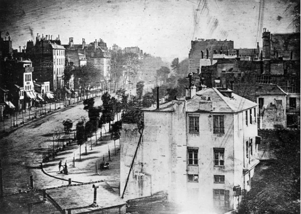

# Введение

Конструкторы фотографических аппаратов и объективов, создатели фотопленок, известные фотографы, искусствоведы и философы, создали материальное и теоретическое богатство, которое имеет практическое значение для создания оригинальных фотографий.

На заре развития фотографии публику очаровали дагерротипы, которые с легкостью передавали с поразительной правдой мелочи и детали. Первоначальное назначение фотография сохраняет до сегодняшних дней.

Йозеф Пецваль в 1840 году рассчитал конструкцию портретного объектива, который эффектно отделял фон от  объекта. С изменениями объектив воспроизведен в 2010-х годах. Использование такого объектива само по себе создает выразительную композицию. С усовершенствованием фотографического процесса и появлением стеклянных пластинок со светочувствительным слоем, фотография попыталась не копировать природу и достигла на этом пути успехов. Основы создания живописного эффекта на фотографии еще в 1869 году доходчиво изложил англичанин Генри Пич Робинсон.

Фотография, на рубеже XIX и XX веков, вслед за живописью, пережила увлечение импрессионизмом. На этом пути немецкий фотограф Генрих Кюн – Heinrich Kuhn применил фотоимпрессионизм, который находит многочисленных поклонников.
Сьюзен Зонтаг — американская писательница, философ и критик отметила, что когда в 1915 году Эдвард Стейхен сфотографировал молочную бутылку на пожарной лестнице жилого дома, зародилось новое представление о том, что такое фотография — это «прямая фотография». С этого момента, фотография вышла из под влияния живописи, и начала искать собственные формы осмысления действительности, у фотографии появился художественный язык усилиями таких мастеров как Альфред Стиглиц, который обратился к обыденному реализму, Йозеф Судек, Эдвард Уэстон с его «новым виденим». Признанным классиком пейзажной фотографии стал американец Ансель Адамс.

Документальная фотография начала развиваться с изобретением в 30-х года прошлого века компактного фотоаппарата, использующего 35 миллиметровую пленку. Образцы репортажной, уличной фотографии созданы советскими фотографами — Евгением Халдеем, Эммануилом Евзерихиным, Георгием Зельма, Борисом Игнатовичем, а также знаменитым французом Анри-Картье Брессоном.
На теоретической и практической основе авангардного искусства, основы которого закладывали Малевич, Кандинский, Петров-Водкин, создавал оригинальные фотографии Александр Родченко, который на языке абстрактных форм умел “читать” повседневные жизненные ситуации, улавливать смысловую связь между окружающими предметами и личностью человека.

В 1936 году выпущена первая в мире многослойная цветная обращаемая фотоплёнка фирмой Agfa. Годом позже компания Eastman Kodak  создала первую цветную фотоплёнку типа 135. Эти пленки на годы установили эталон «пленочного цвета». Фотография уже с помощью цифровых приемов обработки пытается воспроизводить этот цвет, но современные производители фотопленок не только сохраняют, но и развивают заложенные традиции, поддерживая спрос на своеобразный, слегка неестественный, но исключительно привлекательный колорит, у которого много поклонников и в наше время.

Бурно развивающаяся практика, получила теоретическое осмысление в работах писателей, искусствоведов и философов. Кинооператор и искусствовед Лидия Павловна Дыко к 60-м годам завершила теорию создания реалистической фотографии, обобщив классические представления живописи о композиции и приспособив под возможности фотографии. Зигфрид Кракауэр — немецкий социолог массовой культуры, реабилитировал физическую реальность в качестве содержания фотографии. Новый философский ключ Съюзан Лангер позволил ясно увидеть символический характер фотографического изображения. Французский философ Жан Бодрийяр подробно и эмоционально разобрал негативное влияние массовой культуры и созданных ею симулякров на фотографию и предложил примеры «буквальной фотографии».

Для того, чтобы идеи признанных мастеров фотографии, искусствоведов, философов и критиков стали доступны для  использования фотографами-любителями, разберем  идеи на части и покажем, как из из полученного материала собрать собственный смысл и показать его на фотографии.

# Три полочки

## Том 1. На заре фотографии

### Прикладная физика: — Фиксация образов, формирующихся в фокусе в темной комнате.

М. Араго берет слово, чтобы устно передать Академии общее представление о прекрасном открытии, сделанном г-ном Дагером, и о котором большая часть публики до сих пор имела лишь представление. Каждый, говорит мистер Джраго, знает оптический прибор, называемый камера-обскура и чье изобретение принадлежит Джей Би Порта; все заметили, как точно форма, цвета и тона предметов будут воспроизводить себя. на экране, помещенном в фокус большой линзы, которая составляет око этого инструмента. Каждый после любования этими изображениями, предавался сожалению о том, что их не удалось сохранить. Отныне это сожаление будет беспредметным: г-н Дагер открыл пластины, на которых оптический образ оставляет совершенный отпечаток; пластины, где воспроизводится все, что содержалось в изображении, вплоть до самые мелких деталей, с точностью, с невероятной тонкостью. По правде говоря, не будет преувеличением сказать, что изобретатель открыл средства, фиксирующие образы, если бы его метод сохранял цвета: но, надо поспешить сказать это, чтобы разубедить часть публики, есть в картинах, в копиях М. Дагера, как на черном карандашном рисунке, как на офорте или, еще лучше (уподобление будет точнее), как в гравюра в меццо-тинте или акватинте, только белая, черная и серый, – свет, тьма и полутона. Одним словом, в фотолаборатории г-на Дагера свет сам воспроизводит формы и пропорции внешних объектов с почти математической точностью; фотометрические отношения различных тонов точно сохраняются, сохранены белые, черные, серые части. Основные продукты его новых процессов, которые г-н Дагер поставил перед глазами трех академиков, М.М. Гумбольдта, Био и Жраго — вид на большую галерею, соединяющую Лувр с Тюильри; вид на Сите и башни Нотр-Дам; виды Сены и ее мостов, вид на некоторые из капитальные строения. Все эти изображения проверены, не теряя своей чистоты, по крайней мере, для предметов, которые были неподвижно, пока фиксировались их образы. Время, необходимое для выполнения экспозиции, когда мы хотим прибыть при большой силе тона изменяется в зависимости от интенсивности света, времени суток и с сезоном. Летом и в полдень восемь-десять минут достаточно. В других климатических условиях, в Египте, например, мы, вероятно, могли бы ограничить себя две-три минуты. Процесс М. Дагера требовал не только открытия вещества, более чувствительное к действию света, чем те, которые известны физикам и химикам. Нам еще предстояло найти средства лишения его этого имущества по своему желанию; вот что г-н Дагер сделал: его рисунки, когда он их закончит, могут быть выставлены полностью на солнце без каких-либо изменений. Чрезвычайная чувствительность препарата, использованного М. Дагером, не единственная характеристика, которым его открытие отличается; мы когда-то занимались тем, что рисовали силуэты на слой хлорида серебра. Эта соль белая, свет ее чернит, поэтому белая часть изображения становится черной, а части черные, наоборот, остаются белыми. На экранах М. Дагер, рисунок и предмет одинаковы: белому соответствует белый, полутона к полутону, от черного к черному. Изобретение мистера Даггера предложит путешественникам ресурсы для графического изображении памятников архитектуры, широко распространенной в различных частях королевства. Легкость и точность, которая будет результатом новых процессов, даст чертежникам дополнительные возможности, они конечно меньше будут работать на открытом воздухе, но много больше в своих мастерских. Новый реагент, похоже, также даст физикам и астрономам очень ценные средства исследования. По просьбе Академииs, г-н Дагер сделал снимок Луны. Изобретение г-на Дагера является результатом кропотливой работы на протяжении несколько лет, в течение которых он работал со своим другом, покойным M JViepce, из Шалон-сюр-Сон. Ищу, как это может быть компенсировав свои старания и расходы, этот выдающийся живописец не медленно осознавал, что патент на изобретение не приведет его к цели - после обнародования его процессы будут доступны для всех. Поэтому представляется важным, чтобы правительство напрямую компенсировало патент г-на Дагера и что Франция, таким образом, благородно одаривает мир. треть открытия, которое может так много способствовать прогрессу искусства и наука. Г-н Араго объявляет, что он направит запрос по этому вопросу в Министерство или палатам, как только г-н Дагер, выдвинувший инициативу, владеет всеми подробностями своего метода, докажет, что к замечательному свойства которых полученные результаты являются таким ярким проявлением этот метод сочетает в себе, как заявил изобретатель, достоинство экономичности. чем, чтобы быть легким, чтобы путешественники могли использовать его в любом месте. «Г-н Брокс заявляет, что он полностью поддерживает выставку, которую г-н Араго исходит из поразительных результатов, полученных М. Дагером. Прочитав несколько раз лучше видеть их и слушать, как мистер Дагер говорит некоторые из многих экспериментов, которые он провел с чувствительностью перспективу препарата, который ему удалось сочинить, г-н Био считает с г-ном Араго, что он предоставит столько новых средств, сколько пожелает изучить свойства одного из важных для нас природных агентов больше всего знать и что до сих пор у нас было так мало средств поддержки. подвергать испытаниям, не зависящим от наших ощущений. И он не может лучше излагать свои мысли об этом изобретении, чем сравнивать его с новым искусственным пальцем, предоставленный М. Дагером в распоряжение физиков.»

Фотография обладает богатейшими возможностями отражения и познания окружающей нас действительности. Но поначалу фотографию склонны были считать лишь техническим способом фиксации жизненного материала, который охватывается углом зрения объектива съемочного аппарата или, как теперь говорят, “входит в кадр” и воспроизводится на светочувствительном слое.

Такая оценка фотографии основывалась на том, что фотоизображение создается с помощью механического инструмента – фотоаппарата, рисуется оптической системой – объективом, и в дальнейшем проходит химическую обработку с помощью проявителя, закрепителя и других растворов.

Таким образом, в определении возможностей фотографии решающим моментом считали технические средства получения фотоизображения.

Развитие науки и техники, пытливость человеческой мысли, а еще более потребность человечества в простом, доступном, гарантирующем необходимую точность способе получения изображений дали основания и возможности, базу, на которой и возникла фотография.

Этот новый технический способ получения изображения был открыт в 1830 г. и получил название «фотография», что в буквальном переводе означает «светопись». Название отвечало сущности процесса: лучи света проникали в специальную камеру сквозь линзу, объектив, падали на светочувствительный слой, в котором под их воздействием происходили изменения, приводящие к образованию изображения. Изображение как бы «писалось светом».

Это было ново, неожиданно, сулило в будущем необычайные возможности. Способ позволял получать документально точные изображения объектов съемки, повторявшие их во всех деталях и подробностях. Именно за эти свойства фотографию поначалу и ценили более всего. В печати публиковались восторженные отзывы современников, которых приводили в восхищение изображения пейзажей, где чаще всего были отчетливо видны каждый листик на дереве, каждая складка его коры, каждый камешек на дороге. Правда, позже эта способность фотографии уже не вызывала таких восторгов, и на определенном этапе развития, когда «светопись» стала использоваться как средство создания произведений искусства, потребовалось немало усилий художников, чтобы преодолеть эту бесстрастность фотографии и равнодушное повторение на снимке всего, что «видел» и отбрасывал на светочувствительный слой объектив.

Фотогра́фия — технология записи изображения путём регистрации оптических излучений с помощью светочувствительного фотоматериала или полупроводникового преобразователя. В отличие от некоторых других языков, в русском слово «фотография» используется только применительно к статичным изображениям. В то же время в профессиональном кинематографе этот термин обозначает изобразительное решение фильма, создаваемое кинооператором. Фотографиями также называются конечные отпечатки фотографического изображения, изготовленные на фотобумаге химическим способом или принтером.

На технологиях фотографии основано фотоискусство, которое считается одним из видов изобразительного искусства и занимает ключевое место в современной массовой культуре. Первое устойчивое фотографическое изображение было создано в 1822 году французским изобретателем Жозефом Нисефором Ньепсом, но оно не сохранилось до наших дней[1][2]. Датой изобретения технологии по решению IX Международного конгресса научной и прикладной фотографии считается 7 января 1839 года, когда Франсуа Араго сделал доклад о дагеротипии на заседании Французской академии наук[3][4][5][6].

ЗАРЕГИСТРИРОВАННАЯ ДЕЙСТВИТЕЛЬНОСТЬ – показ объектов, имеющих какое-либо значение.

7 января 1839 года на заседании Французской академии наук, физик Доминик Франсуа Араго сделал доклад о работах химика Луи Дагера, в результате которых был разработан метод получения отпечатка изображения (дагеротипа). В этот день человечество шагнуло в эру фотографии.

Дагероти́пия (фр. daguerréotype) — ранний фотографический процесс, основанный на светочувствительности йодистого серебра. Первая в мире работоспособная технология фотографии, использовавшаяся в течение двух десятилетий и вытесненная во второй половине XIX века более дешёвыми и удобными процессами.

Получаемые с помощью этой технологии дагеротипы напоминают не современные фотоснимки, а отражение в зеркале. Их изображение состоит из амальгамы, образующейся при взаимодействии серебра и ртути, поэтому дагеротипия часто называлась «зеркалом с памятью». В зависимости от наклона пластинки к источнику света при рассматривании дагеротип может выглядеть как позитив и как негатив[1][2]. Это приводит к неудобству, позволяя видеть нормальный снимок только под определённым углом, но в то же время создаёт иллюзию реальности образа. Репродукции дагеротипов дают лишь общее представление об их изображении, не передавая его подлинного вида.

Это были постановочные студийные кадры или фиксация статичных объектов.

## Том 2. Студийный портрет XIX века

Несмотря на все трудности, получение портретов стало главной сферой коммерческого применения дагеротипии. В начале марта 1840 года в Нью-Йорке открылось первое в мире портретное фотоателье. Солнечный свет внутрь помещения направлялся с помощью двух зеркал, а позднее начали строить специальные павильоны со стеклянными крышей и стенами. Несмотря на это, время выдержки доходило до 30 минут, требуя неподвижного положения портретируемого. Для предотвращения смазывания голова закреплялась специальным держателем — «копфгальтером» (нем. Kopfhalter). Чтобы хоть как-то сократить выдержку, некоторые фотографы натирали лица своих клиентов пудрой и даже мелом, но многие всё равно не выдерживали, засыпая перед камерой. Для облегчения страданий сидящих под прямыми солнечными лучами падающий на них свет иногда загораживали голубым стеклом, не задерживающим актиничный для светочувствительных пластин синий свет. В американских салонах даже появилась мода на голубое остекление павильонов[33]. В июне 1841 года Антуан Клоде открыл подобную студию Adelaide Gallery вблизи церкви Святого Мартина в Полях в Лондоне[34]. Существенный прорыв в получении качественных дагеротипных портретов связан с появлением в 1840 году объектива Петцваля, обладавшего высокой светосилой f/3,6[27]. Аналогичное изобретение было практически одновременно сделано американцем Александром Уолкоттом (англ. Alexander S. Wolcott), запатентовавшим дагеротипную камеру с вогнутым зеркалом вместо объектива[35]. Светосильная оптическая схема, позаимствованная у телескопа-рефлектора, позволила сократить выдержку с тридцати минут у первых фотоаппаратов до пяти у «зеркального»[36]. Через год выдержка при портретной съёмке достигла рекордного значения в 1 секунду[37]. К середине 1840-х годов основные трудности были преодолены, и портретирование стало успешным бизнесом. Началось распространение дагеротипных фотоателье по всему миру, а в США появился целый город Дагеровиль со множеством портретных студий[38]. Примерно в это же время в судебную практику были введены дагеротипные портреты разыскиваемых преступников. В конце концов дагеротипный фотопортрет полностью вытеснил портретную миниатюру, заставив большинство художников этого направления переквалифицироваться в фотографы[39].

Дагеротипия оставалась доминирующей технологией фотографии вплоть до изобретения мокрого коллоидного процесса в 1851 году. В настоящее время (2017 год) получила некоторое распространение в качестве альтернативного фотопроцесса в среде фотохудожников[40].

## Том 3. Живописный эффект в фотографии

**Откровенная действительность** - прямая фотография, буквальное на фотографиях Бодрийяра, ломография, реалистическое направление Зигфрида Кракауэра, _pinctum_ Ролана Барта. Протест против мейнстрима. Действительность имеет содержание, которое нужно только показать.

УЛУЧШЕННАЯ ДЕЙСТВИТЕЛЬНОСТЬ – временные тенденции, определяющие стиль и содержание фотографий, поддерживаемые обществом и потребителями.

**Мейнстрим** - социалистический реализм, инстаграм, гламур, глянец, селфи. Неприкрашенная действительность есть дискредитация действительности.

ИДЕАЛЬНЫЕ ПОНЯТИЯ, транслируемые с помощью композиционных построений.

**Бескомпромиссная идеализация** - Родченко, Петров-Водкин, импрессионизм, пикториализм. Воспитание чувств, необходимых для строительства нового мира. Голые беспредметные ракурсы и композиционные схемы, по канонам супрематизма, вызывают особенные чувства. Изменение направления угла взгляда меняет отношение к миру.  Бескомпромиссная идеализация.

# Выбор объективов и фотоаппарата

Оптимальным выбором для фотографа любителя будет линейка обьъективов, рассчитанная на применение с полукадровой матрицей формата APS-C или Micro Four Thirds — Micro 4/3. Объективы с переменным фокусным расстоянием или зум-объективы более универсальны в применении к различным условиям съемки, но по сравнению с объективами с фиксированным фокусным расстоянием обладают, как правило несколько меньшей светосилой, что снижает возможности по созданию художественных эффектов при съемке.

Фотоаппараты с меньшей матрицей и с несменными объективами, включая камеры мобильных телефонов, нельзя рекомендовать для использования в художественной фотографии по причине их ограниченных оптических возможностей, которые не позволяют создавать размытие заднего фона на длинном фокусе и разделять глубиной резкости одни части объектов от других близко расположенных.

Линейка объективов, рассчитанная на применение с полнокадровыми матрицами — full-frame, обладает большими творческими возможностями в силу физического размера матрицы, которые позволяют получать меньшую глубину резкости со светосильными средне- и длиннофокусными объективами, что невозможно на матрицах размера меньше чем полукадровый в силу физических ограничений. Только на полнокадровой матрице некоторые творческие объективы, собранные например по схеме Петцваля из четырех линз, полностью раскрывают свои возможности.

Учитывая, что художественные фотографии, как правило, обрабатываются в графических редакторах, набор функций фотоаппарата может быть минимальным. Профессиональные фотоаппараты с максимальным набором функций находят применение, в основном, при репортажной съемке, когда полученный снимок необходимо оперативно опубликовать без дополнительной обработки, опираясь только на богатые возможности управления съемкой,заложенные в профессиональную камеру.

Размер матрицы фотоаппарата в 24 мегапикселя достаточен для печати фотоснимков любого размера, за исключение особо крупноформатных, размеров, например 2 на 3 метра. Фотографии большого формата рассматриваются с более значительного расстояния, чем фотографии малого и среднего размера, поэтому глаз на таком расстоянии не замечает увеличенный размер пикселя и воспринимает изображение как четкое.